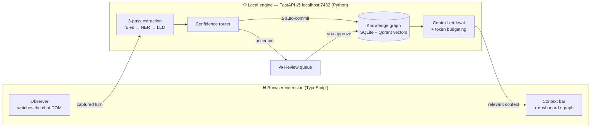
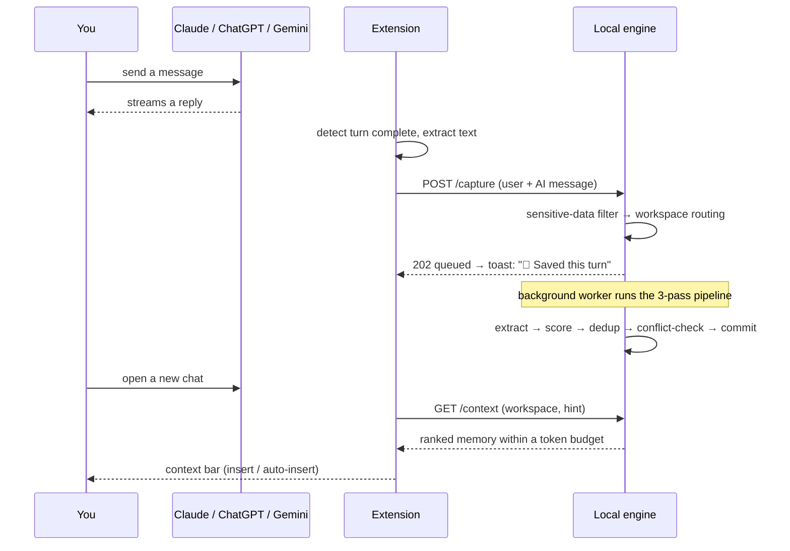
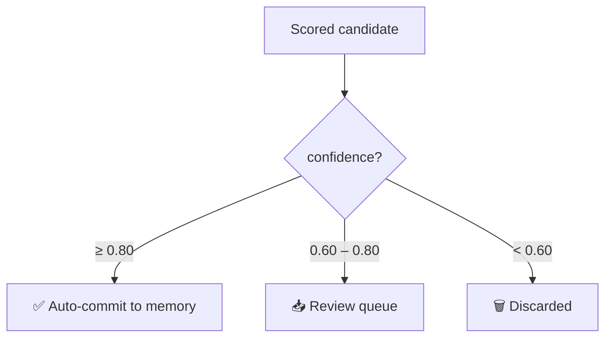

<div align="center">

# 🧠 Mnemosyne

### Give your AI the memory it was born without.

**A local-first cognitive memory engine for Claude, ChatGPT & Gemini.**
It quietly learns what matters from your conversations, organizes it into a structured
knowledge graph, and feeds the right context back into every new chat — so you stop
re-explaining yourself, and your AI stops forgetting you.

[](LICENSE)
[](https://www.python.org)
[](https://www.typescriptlang.org)
[](https://fastapi.tiangolo.com)
[](#-privacy--security)
[](#-contributing)

*Named after the Greek goddess of memory — mother of the nine Muses. Memory is the foundation of intelligence.*

</div>

---

## The problem

Every time you open Claude, ChatGPT, or Gemini, you start from zero. You re-explain who
you are, what you're building, what stack you use, what you already decided, and what you
prefer. **Every. Single. Time.** This isn't an intelligence problem — these models are
brilliant. It's a **continuity** problem.

Mnemosyne is the persistent layer that lives between sessions. A note-taker that follows
you through every conversation, writes down what matters, files it into a per-project
knowledge graph, and briefs the AI before you type your first word — **entirely on your
machine. No cloud. No account. No conversation text ever leaves your computer.**

## ✨ Highlights

- 🧩 **Structured memory, not transcripts** — extracts *goals, decisions, facts,
  preferences, problems, ideas* as typed nodes in a knowledge graph. Never stores raw chat.
- 🔬 **3-pass cognitive extraction** — fast rules → spaCy NER → an optional local LLM
  (Ollama). Each pass is corroborated and confidence-scored.
- 🎯 **Confidence-based routing** — high-confidence memories auto-save; uncertain ones
  wait in a review queue you approve or reject. *You* are the final quality gate.
- 🗂️ **Per-workspace isolation** — work, research, and side-projects never bleed together.
  New topics can spin up their own workspace automatically.
- ⚔️ **Conflict resolution & decay** — contradictions are detected and resolved (or
  queued); stale memories fade, frequently-used ones stay strong — like a real brain.
- 🧹 **Smart de-duplication** — the same fact mentioned across 20 turns becomes *one*
  reinforced node (exact + semantic matching), not 20 duplicates.
- 🔒 **Encrypted at rest** — SQLCipher AES-256, with a key derived from your machine.
- 📊 **A real graph UI** — browse, search, add/edit/boost/delete nodes, resolve conflicts,
  replay sessions, and export to JSON / CSV / Markdown.
- 🧪 **Measured quality** — a precision/recall eval harness gates extraction changes in CI,
  so quality is proven, not guessed.

## 🎬 What it feels like

You open a brand-new chat about your e-commerce side-project. Before you type anything, a
slim bar appears at the top:

```
🧠 Mnemosyne   [ E-commerce Startup ▾ ]   11 items · 487 tokens   [ Insert into prompt ]
```

Click it and you see exactly what it knows — and will brief the AI with:

```
[MNEMOSYNE — Workspace: E-commerce Startup]

Current Goals:
• Launch the beta by July 1 [HIGH PRIORITY]
Recent Decisions:
• Dropped the mobile app from v1 — reason: focus
Ideas & Insights:
• Idea — referral loop: invite credits that compound per successful signup
Technical State:
• Uses Next.js · Stripe · Supabase · Vercel
Open Problems:
• Checkout latency spikes under load
```

You type *"help me think through the checkout flow"* — and the AI already knows your stack,
your deadline, and your prior decisions. Meanwhile, as you chat, a quiet toast confirms
the loop is closing:

> 🧠 Saved this turn to memory

> 💡 *Tip: drop a screen recording at `docs/demo.gif` and embed it here — the capture →
> graph → inject loop is the money shot.*

## 🧠 How it works



### The capture loop, step by step



### 1 · Three-pass extraction

Every captured turn passes through layered extractors, each adding signal the others miss:

| Pass | Engine | Speed | Role |
|------|--------|-------|------|
| **Rules** | regex patterns | <50 ms | high-precision goals, decisions, choices, tech facts |
| **NER** | spaCy `en_core_web_sm` | ~ms | named entities, dates, deadlines |
| **LLM** *(optional)* | Ollama (`phi4-mini`) | ~secs | phrasing-robust reasoning over the full turn |

The LLM is the **ceiling** (catches anything, any phrasing); rules + NER are the
**deterministic floor** that work with zero external dependencies. If Ollama isn't
installed, the pipeline self-skips it instantly and keeps working.

> Hypotheticals and negations are filtered out — *"what if we used MongoDB?"* and *"we're
> **not** going to use Redis"* never become facts.

### 2 · Confidence routing

Candidates are merged across passes (agreement *adds* confidence), then routed:



Both thresholds are **live-tunable** from the dashboard. Explicit commitments
(*"let's go with Postgres"*) and stated intents (*"I want to build X"*) are scored to
auto-commit; vague entities are demoted so they don't flood the queue.

### 3 · Memory model

| Node type | Example |
|-----------|---------|
| 🎯 Goal | "Ship the beta by Sunday" |
| ⚖️ Decision | "We chose PostgreSQL — async + consistency" |
| 🔧 Technical fact | "Backend runs on FastAPI" |
| 💡 Insight / idea | "Idea — referral loop: compounding invite credits" |
| ❤️ Preference | "Prefers concise, code-first answers" |
| 🚧 Problem | "OAuth callback returns 500" |
| 🧑 Entity | "Dr. Chen is the mentor" |
| 📅 Event | "Launched v1 on June 5" |

### 4 · Living memory

- **Conflicts** — when a new fact contradicts an old one, recent/verified usually wins
  automatically (with a `superseded` audit trail); genuinely ambiguous cases are queued.
- **Decay** — importance fades with disuse and is reinforced on every retrieval; mark
  anything *permanent* to pin it.
- **De-duplication** — exact + embedding-based, so "Uses Go" mentioned every turn is one
  reinforced node, not noise.
- **Encryption & audit** — AES-256 at rest (SQLCipher) and an append-only audit log of
  every extraction, resolution, and deletion.

## 🚀 Quickstart

> **Requirements:** Python 3.12+, a Chromium browser (Chrome / Edge / Brave / Arc).
> Ollama is **optional** (enables the deeper LLM pass).

### 1 · Engine

```bash
git clone https://github.com/MuhammadAhmed43/mnemosyne.git && cd mnemosyne
python -m venv .venv && . .venv/bin/activate     # Windows: .venv\Scripts\activate
pip install -e .                                  # installs deps + the spaCy model
mnemosyne-engine                                  # → http://localhost:7432
```

You'll see a capability banner showing what's active (encryption, embeddings, NER, LLM):

```
  ┌─ Mnemosyne engine v1.0.0 ─────────────────────────
  │  URL:          http://127.0.0.1:7432
  │  Encryption:   AES-256 at rest
  │  Embeddings:   on
  │  NER (spaCy):  on
  │  LLM (Ollama): on
  │  Open Claude / ChatGPT / Gemini — the extension auto-pairs.
  └────────────────────────────────────────────────────
```

*Optional, for deeper extraction:* install [Ollama](https://ollama.com), then
`ollama pull phi4-mini`. Mnemosyne detects it automatically.

### 2 · Extension

```bash
cd extension
npm install
npm run build:chrome      # → extension/build/chrome-mv3-prod
```

In Chrome: **`chrome://extensions`** → enable **Developer mode** → **Load unpacked** →
select `extension/build/chrome-mv3-prod`. Open Claude / ChatGPT / Gemini — a green dot on
the toolbar icon means it's paired and capturing.

## 🕹️ Usage

- **Just chat.** The toolbar icon shows engine status; a context bar appears in-page.
- **Dashboard** (toolbar → *Memory Audit*): browse & search memories, an interactive
  knowledge graph (add / edit / boost / delete), pending reviews, conflicts, session
  replay, and **export to JSON / CSV / Markdown**.
- **Keyboard shortcuts:** `Alt+W` controls · `Alt+M` sidebar · `Alt+P` pause capture ·
  `Alt+I` incognito *(customize at `chrome://extensions/shortcuts`)*.
- **Privacy controls:** pause per-conversation, go incognito for a session, disable a
  whole workspace, or rely on the always-on sensitive-data filter.

Your data lives in `~/.mnemosyne` (macOS/Linux) or `%APPDATA%\Mnemosyne` (Windows).

## ⚙️ Configuration

Tune from the dashboard's Settings (all live, no restart):

| Setting | Default | What it does |
|---------|---------|--------------|
| Auto-commit threshold | `0.80` | ≥ this → straight to memory |
| Min confidence | `0.60` | < this → discarded; between → review queue |
| Token budget | `2000` | max context injected per chat |
| LLM extraction | `on` | use Ollama for the deep pass |
| Sensitive-data filter | `on` | block API keys, passwords, etc. before storage |
| Decay | `on` | let unused memories fade over time |

## 🏗️ Architecture

```
mnemosyne/
├── backend/                 # Python engine (FastAPI)
│   ├── extraction/          # rules · NER · LLM · idea · scorer · hypothetical filter
│   ├── services/            # capture · retrieval · conflict · decay · graph · workspace …
│   ├── repositories/        # SQLite data access (per-workspace + global)
│   ├── routes/              # REST + WebSocket API
│   ├── workers/             # async extraction / decay / consolidation / backup
│   ├── db/                  # connection mgmt + SQLCipher encryption
│   └── models/              # Pydantic schemas
├── extension/               # Chrome MV3 extension (TypeScript + React + Plasmo)
│   ├── lib/                 # observer · injector · api client · toast · store
│   ├── components/          # dashboard, graph, cards, review UI
│   └── contents/            # content script
└── tests/                   # pytest + the extraction eval harness
```

| Layer | Tech |
|-------|------|
| Engine | Python 3.12 · FastAPI · Pydantic v2 · uvicorn |
| Storage | SQLite (FTS5 + recursive CTEs) · SQLCipher · Qdrant (vectors) |
| ML | fastembed (BGE-small) · spaCy · Ollama *(optional)* |
| Extension | TypeScript · React 18 · Plasmo · Zustand · Cytoscape.js |

## 🧪 Quality & testing

Extraction quality is **measured, not vibed**. A labeled dataset of conversation turns
(`tests/eval/cases.py`) declares what *should* and *should not* be extracted, and a scorer
computes precision/recall:

```bash
pytest                                        # full suite (unit · api · integration)
python tests/eval/test_extraction_quality.py  # extraction quality report (recall, leaks)
cd extension && npm test                       # extension tests (vitest)
```

The eval runs on the **deterministic** pipeline (LLM off) so it's reproducible, and it
gates CI: a change that improves one case but breaks another fails the build. New
real-world misses become new labeled cases — and never regress again.

## 🔒 Privacy & security

- **Nothing leaves your machine** — extraction, storage, and retrieval are 100% local.
  Raw conversation text is never persisted; only structured facts are.
- **Encrypted at rest** — SQLCipher AES-256 with a machine-derived key.
- **Sensitive-data filter** — API keys, passwords, card numbers, and secrets are blocked
  *before* any processing.
- **Full control & transparency** — pause/incognito anytime, soft-delete with history, and
  an immutable audit log of every action.
- **Optional cloud** — the only network calls are the one-time model download and (if you
  install it) your *local* Ollama. No telemetry.

## 🛣️ Roadmap

- [ ] One-click installers / auto-start service (currently run via `mnemosyne-engine`)
- [ ] Chrome Web Store listing
- [ ] Firefox & Safari support
- [ ] Encrypted multi-device sync (opt-in)
- [ ] Proactive surfacing ("you decided the opposite last week")

## 🤝 Contributing

Contributions are welcome! Good first steps: add a labeled case to `tests/eval/cases.py`
for an extraction you wish worked better, then make it pass.

```bash
pip install -e ".[dev]"            # dev tooling (pytest, ruff, mypy)
pytest && cd extension && npm test # run everything before a PR
```

## 📄 License

[MIT](LICENSE) © 2026 Muhammad Ahmed

<div align="center">
<sub>Built because a brilliant colleague who forgets you every morning is exhausting — and fixable.</sub>
</div>
